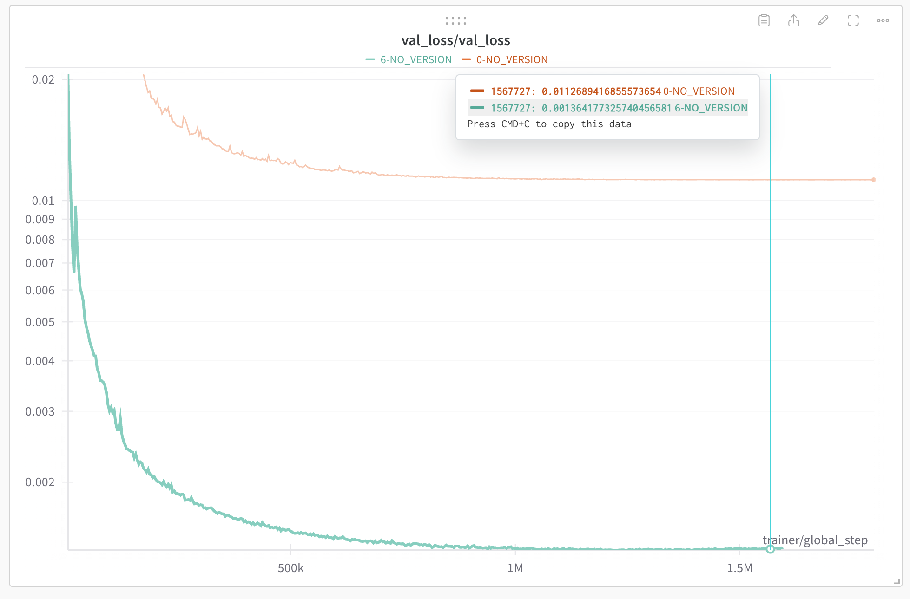
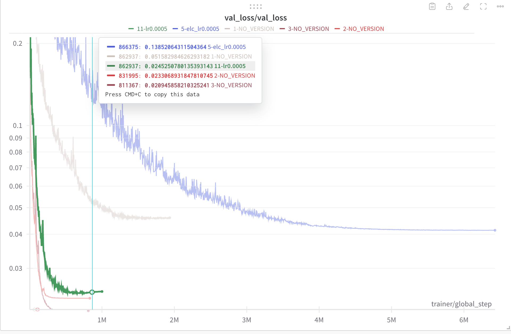
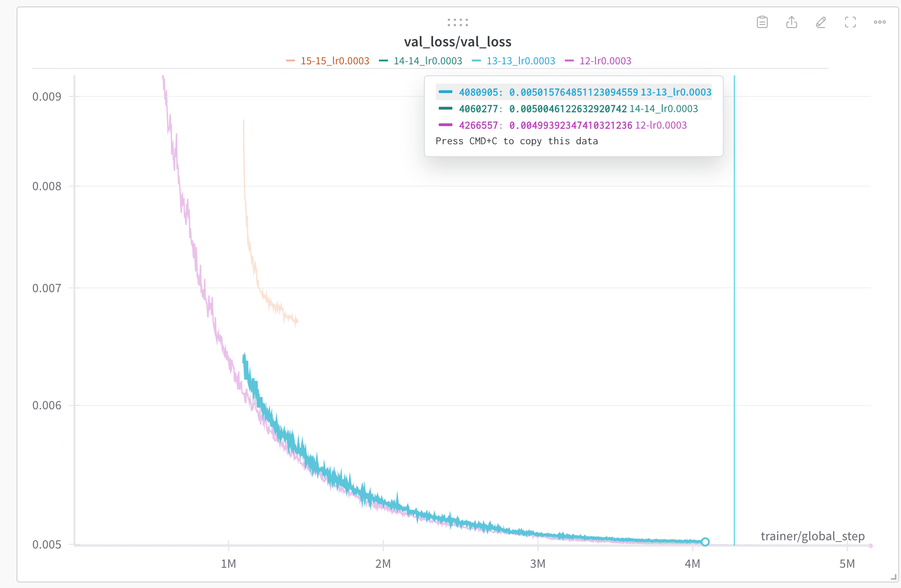
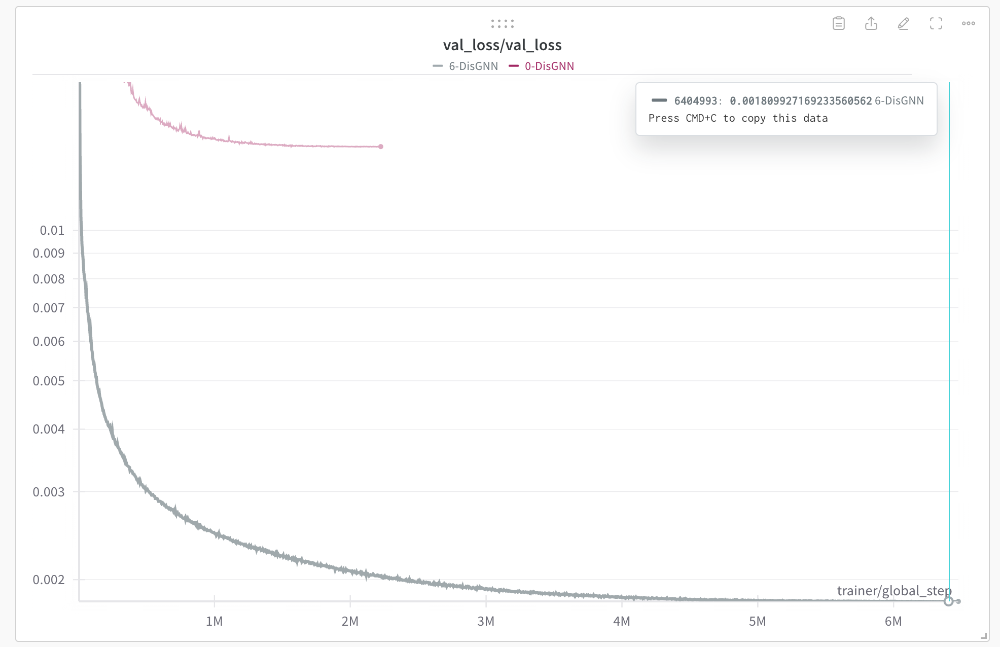
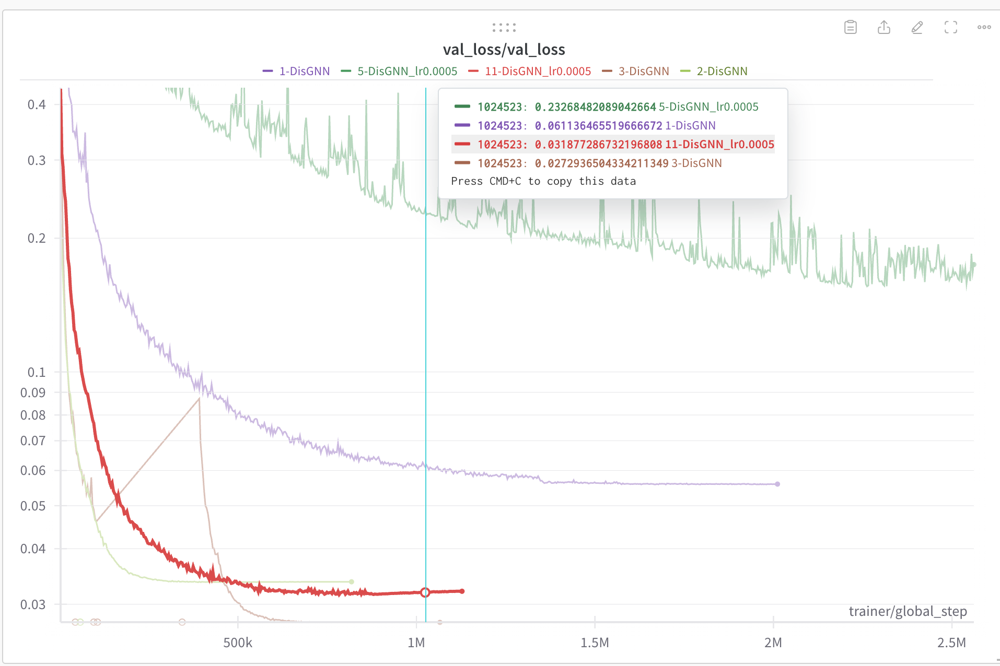
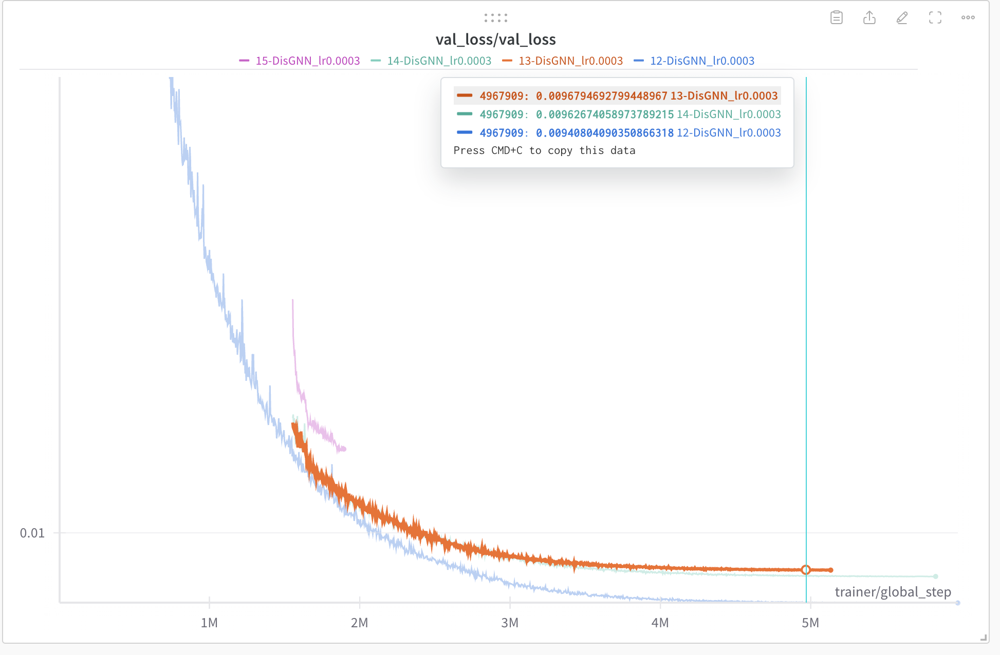

# GeoNGNN_rebuttal_NIPS

We provide the GeoNGNN code, **including QM9**, in `./GeoNGNN_include_QM9`. Please refer to the `README.md` file in the directory for detailed usage instructions and hyperparameter settings.

## Validation Curves of GeoNGNN on QM9

The property index to property name correspondence can be found [here](https://pytorch-geometric.readthedocs.io/en/latest/generated/torch_geometric.datasets.QM9.html?highlight=qm9#torch_geometric.datasets.QM9).

**For properties 0 and 6:**

**For properties 1, 2, 3, 5, and 11:**

**For properties 12-15:**

## Validation Curves of DisGNN on QM9

**For properties 0 and 6:**

**For properties 1, 2, 3, 5, and 11:**

**For properties 12-15:**
